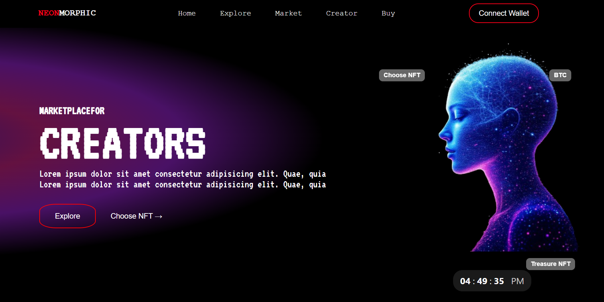

🌐 Neon Morphic — NFT Marketplace (Frontend)

Neon Morphic is a modern NFT marketplace frontend built with the MERN stack (React for frontend).
It provides a sleek interface for browsing, showcasing, and preparing for buying/selling NFTs. While the current version focuses on UI and collection display, the foundation is set for full Web3 integration.

✨ Features

🎨 NFT Collection Display — Showcase curated digital assets.

💡 Modern UI/UX — Clean, responsive, and optimized for smooth browsing.

🚀 MERN Stack Frontend — React-based, ready for blockchain integration.

🔮 Scalable Design — Built with future smart contract + wallet integration in mind.

🛠️ Tech Stack

Frontend: React (with JSX, Hooks, and Context API)

Styling: CSS / Tailwind / Styled Components (depending on your stack)

State Management: React hooks / Context

Backend Ready: Designed to plug into Express + MongoDB (future scope)

📦 Installation & Setup

Clone the repository and install dependencies:

# Clone the repo
git clone https://github.com/TalhaMasood23/Nft_Project.git

# Navigate into project
cd neon-morphic

# Install dependencies
npm install

# Start development server
npm start

Your app will be live at http://localhost:3000.

📂 Project Structure
neon-morphic/
├── public/          # Static assets
├── src/
│   ├── components/  # Reusable UI components
│   ├── pages/       # Main app pages (Home, Marketplace, Collections)
│   ├── utils/       # Helper functions
│   └── App.js       # Root component
├── package.json
└── README.md

🚀 Future Scope

🔗 Wallet Integration (MetaMask, WalletConnect, etc.)

💸 Buy/Sell Functionality via smart contracts

🖼️ NFT Minting support

🌍 Multi-chain Support (Ethereum, Polygon, Solana)

🛡️ User Profiles and favorites/watchlist

🤝 Contributing

Contributions are always welcome!

Fork the project

Create a new branch (git checkout -b feature-name)

Commit your changes (git commit -m "Add new feature")

Push to your branch (git push origin feature-name)

Open a Pull Request

📜 License

This project is licensed under the MIT License.
You are free to use, modify, and distribute it as long as proper credit is given.

🙌 Acknowledgements

React

MongoDB

Express.js

Node.js

